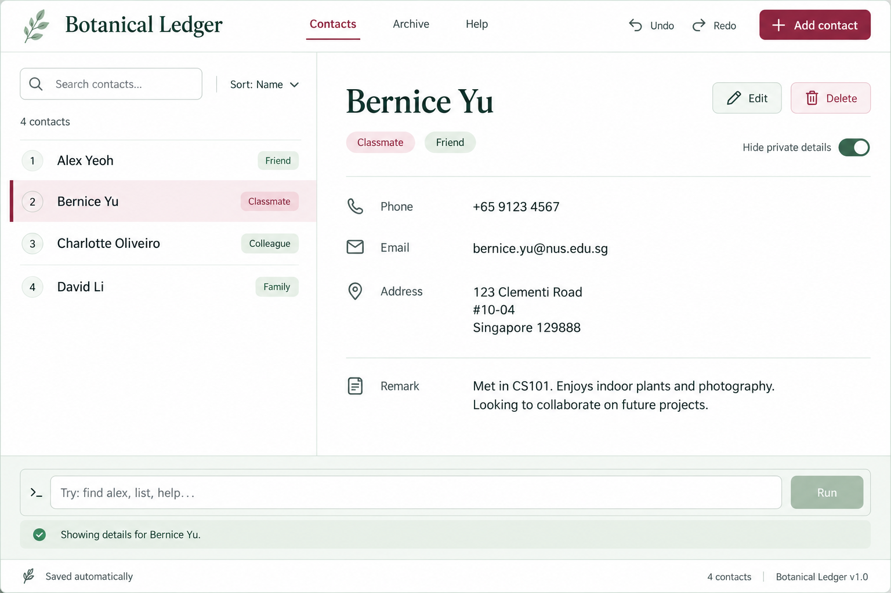

* This is **a sample project for Software Engineering (SE) students**. 
  Example usages:
  * as a starting point of a course project (as opposed to writing everything from scratch)
  * as a case study
* The project simulates an ongoing software project for a desktop application (called _AddressBook_) used for managing contact details.
  * It is **written in an object-oriented programming (OOP) style** and provides a **reasonably well-written** codebase of about 6 KLoC. It is **larger** than what students typically write in beginner-level software-engineering modules, without being overwhelming.
  * It comes with a **reasonable level of user and developer documentation**.
* It is named `AddressBook Level 3` (`AB3` for short) because it was initially created as a part of a series of `AddressBook` projects (`Level 1`, `Level 2`, `Level 3` ...).
* For the detailed documentation of this project, see the **[Address Book Product Website](https://se-education.org/addressbook-level3)**.
* This project is a **part of the se-education.org** initiative. If you would like to contribute code to this project, see [se-education.org](https://se-education.org/#contributing-to-se-edu) for more info.

## **Key Features**

Use the commands below to manage student profiles and lesson records.

| Feature | Command | Example |
|---|---|---|
| Add a student profile with academic level, subjects, and parent contact details | `addstudent n/NAME lvl/LEVEL s/SUBJECT... pn/PARENT_PHONE pe/PARENT_EMAIL` | `addstudent n/Alex Yeoh lvl/Sec 2 s/Math s/Science pn/91234567 pe/parent_alex@example.com` |
| Delete a student and their lesson notes | `deletestudent INDEX` | `deletestudent 3` |
| View a student's full profile | `view INDEX` | `view 2` |
| Add a dated lesson note | `addnote INDEX d/DATE subj/SUBJECT note/NOTE_TEXT` | `addnote 1 d/2026-09-18 subj/Math note/Covered quadratic equations` |
| Delete a lesson note | `deletenote INDEX ln/LESSON_INDEX` | `deletenote 1 ln/2` |
| View a student's lesson history | `history INDEX` | `history 1` |

## **Documentation and Resources**

- [User Guide](https://ay2627s1-cs2103t-f11-4.github.io/tp/UserGuide.html)
- [Developer Guide](https://ay2627s1-cs2103t-f11-4.github.io/tp/DeveloperGuide.html)
- [About Us](https://ay2627s1-cs2103t-f11-4.github.io/tp/AboutUs.html)
